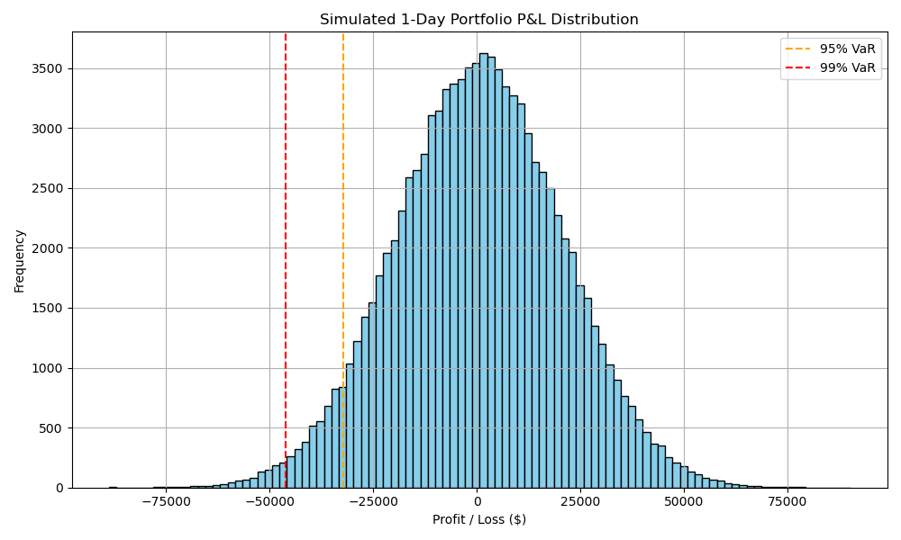

# Monte Carlo Simulation – Value at Risk (VaR)

This project estimates the **Value at Risk (VaR)** of a financial portfolio using Monte Carlo simulation.  
VaR is a commonly used risk metric that estimates the potential loss in value of a portfolio over a given time period, at a certain confidence level.

---

## 🧠 What This Project Does

- Simulates **100,000 possible 1-day returns** for a portfolio, assuming normally distributed returns
- Uses historical daily **mean return** and **volatility** to parameterise the simulation
- Computes the **portfolio’s daily profit/loss distribution**
- Estimates the **95% and 99% 1-day VaR** — i.e., the maximum expected loss 95% or 99% of the time
- Visualises the return distribution with clear VaR cut-off lines

---

## 📈 Output: Histogram and Interpretation



Each bar in the histogram represents how frequently a simulated daily profit or loss occurred across 100,000 trials.

- The orange and red dashed lines mark the **5th and 1st percentiles**, corresponding to the **95% and 99% VaR levels**.
- These indicate the dollar amount you could lose with 5% or 1% probability under normal market conditions.

### 🔍 Example:
If the 95% 1-day VaR is `$36,500`, this means:

> There is a 95% chance the portfolio will **not** lose more than $36,500 in one day.  
> Conversely, there is a **5% chance** the loss will exceed that amount.

---

## 📊 Why Monte Carlo?

Monte Carlo simulation allows us to **generate thousands of potential future outcomes**, even when real market data is limited.  
This method is especially useful when:

- Return distributions are complex or non-linear
- You want to simulate forward-looking risk using custom assumptions
- VaR needs to be estimated for portfolios without long return histories

---

## 🔧 Tools Used

- Python
- NumPy
- Matplotlib

---

## ▶️ How to Run

1. Clone the repository or download the ZIP
2. Open the notebook `monte_carlo_var.ipynb` in Jupyter Notebook or VS Code
3. Install required libraries:
```bash
pip install numpy matplotlib
